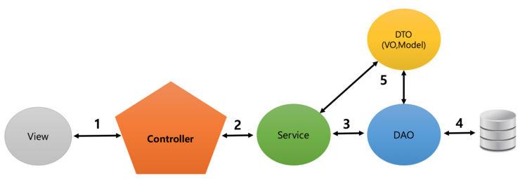

## 프로젝트 파일 구조를 변경하게된 이유
  
스프링 프로젝트를 시작을 하였다.  
  
첫 시작은 Service 패키지 없이 IDao에서 DB연결과 컨트롤러 Mapper를 통해 서비스 구현을 시도해보았으나,  
  
간단한 입출력 기능은 가능하나, 페이징 처리, 검색 기능, 로그인/로그아웃 등의 기능을 구현하기에는 코드가 다소 복잡해보일것으로  
  
예상되어 급하게 프로젝트의 파일 구조를 변경하게 되었다.  
  
구조를 변경하는 과정속에서 진행하게된 github 블로그 개설과 github에서 타인의 프로젝트를 참고하여 프로젝트의 파일 구조를  
  
참고하게 되었다. 또한 주변 선배 개발자들의 도움을 통해 앞전에 하고있던 프로젝트의 파일구조상 코드가 정리 되지 않아 추후 유지보수나, 기능추가 등을 구현할때  
  
많은 어려움이 있을것이라는 의견을 참고하여 프로젝트 파일 구조를 변경하게 되었다.
  
  
## 변경전 스프링 프로젝트의 대략적 구동 원리를 알게됨  
  
  
  
인터페이스 : 클래스
도메인 : dto, dao, repository
어플리케이션 : service  
  
